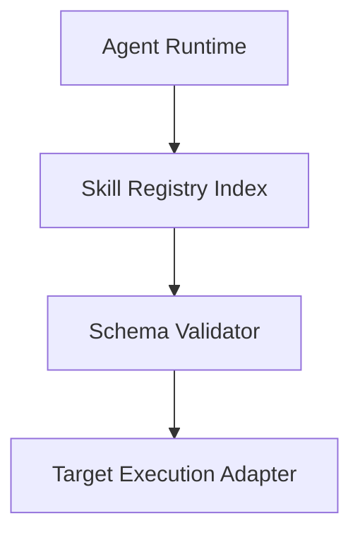

# RFC {NUMBER}: {RFC_TITLE}

* **Status**: Draft | Under Review | Approved | Implemented | Deferred | Withdrawn | Rejected
* **Author(s)**: {NAME / GITHUB_HANDLE}
* **Created**: {YYYY-MM-DD}
* **Target Version**: {vX.Y.Z}
* **Discussion Issue/PR**: {LINK_TO_PR_OR_ISSUE}

---

## 1. Summary & Motivation

{Provide a high-level 2-3 paragraph explanation of the proposal. What problem does it solve, who does it affect, and why should this change be incorporated into the project?}

---

## 2. Goals & Non-Goals

### Goals
- {Goal 1: Clear, measurable outcome}
- {Goal 2: Invariant or property to be preserved}

### Non-Goals
- {Explicitly out-of-scope item 1}
- {Explicitly out-of-scope item 2}

---

## 3. Detailed Specification & Design

### A. Syntax / Schema / API Contract
```json
{
  "$schema": "https://example.com/schema/v2.json",
  "name": "example"
}
```

### B. Architecture & Data Flow


### C. Downstream Impact & Blast Radius
- Impact on existing client agents (Cursor, Claude Code, Antigravity, OpenCode).
- Resource overhead (memory footprint, disk size, startup latency).

---

## 4. Backward Compatibility & Migration Plan

- **Breaking change**: Yes / No
- **Deprecation schedule**: Grace period and timeline for legacy formats.
- **Automated migration**: Codemod or script availability (e.g., `python3 scripts/migrate_v1_to_v2.py`).

---

## 5. Alternatives Considered

- **Alternative 1**: {Description and rationale for rejection}
- **Alternative 2**: {Description and rationale for rejection}

---

## 6. Unresolved Questions & Open Discussions

1. {Open question 1}
2. {Open question 2}
